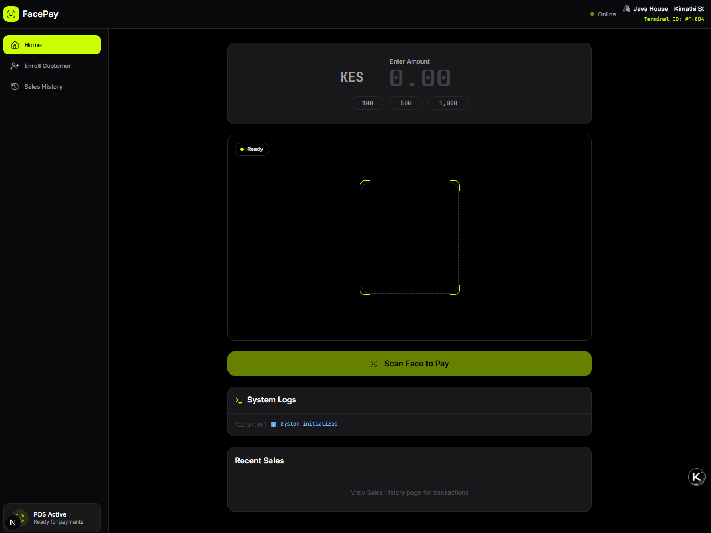
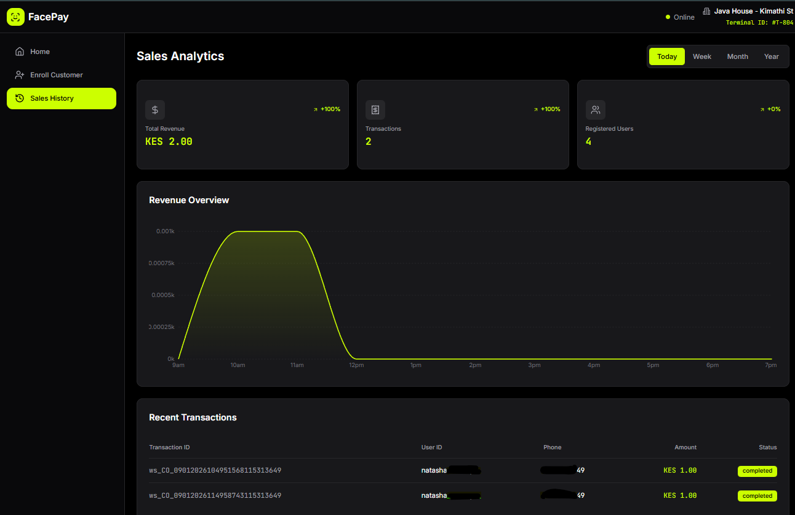

# Face Recognition Payment System

A cutting-edge contactless payment solution that leverages facial recognition technology combined with M-Pesa mobile payments for secure and seamless transactions.

## Project Purpose

This system facilitates contactless payments using facial recognition. Users can authenticate payments through facial recognition, and the system processes payments via M-Pesa STK Push.

The system provides a hygienic, fast, and secure payment experience ideal for retail environments, restaurants, and service industries where contactless transactions are preferred.

## Application Screenshots

### Home Page


The main dashboard showing real-time payment status and camera feed for face recognition.

### Registration Page


User registration with multi-sample face enrollment for improved accuracy.

### Sales Analytics Dashboard


Comprehensive sales analytics with time-based filtering and percentage change comparisons.

## Technology Stack

### Hardware
- **Camera**: High-definition camera for facial recognition
- **POS Terminal**: Point of Sale terminal for transaction processing

### Software
- **OpenCV (Vision)**: Computer vision library for image processing and facial detection
- **DeepFace (Model)**: Deep learning model for robust facial recognition with ArcFace
- **MediaPipe (Gestures)**: Hand tracking and gesture recognition framework
- **M-Pesa API (Payments)**: Integration with Safaricom Daraja API for transaction processing
- **Firebase (Database)**: Cloud database for user authentication, transaction records, and system data
- **Next.js (Frontend)**: React framework with TypeScript for the user interface
- **FastAPI (Backend)**: Python web framework for API endpoints
- **TensorFlow-CPU 2.17.1**: Machine learning framework for DeepFace

## Quick Start

### Prerequisites
- Python 3.12
- Node.js 18+
- Firebase project credentials
- M-Pesa API credentials (Sandbox)
- ngrok (for M-Pesa callback URL during development)

### Installation (Mac/Linux)

1. **Clone the repository**
   ```bash
   git clone https://github.com/your-repo/face-payment-backend.git
   cd Face-Pay
   ```

2. **Create and activate virtual environment**
   ```bash
   python3 -m venv venv
   source venv/bin/activate  # Mac/Linux
   ```

3. **Install Python dependencies**
   ```bash
   pip install -r requirements.txt
   ```

   **Important Dependency Notes:**
   
   The project has specific version requirements to avoid conflicts. After installing requirements, ensure these versions:
   ```bash
   pip install "numpy<2.0"              # NumPy 2.x breaks OpenCV 4.x
   pip install "tensorflow-cpu==2.17.1"  # Required for DeepFace
   pip install "tf-keras==2.16.0"        # Required for TensorFlow 2.17
   ```

   **Why these versions?**
   - **NumPy < 2.0**: OpenCV 4.x is incompatible with NumPy 2.0+ due to breaking C API changes
   - **TensorFlow-CPU 2.17.1**: Stable version that works with Python 3.12 and DeepFace
   - **tf-keras 2.16.0**: Required adapter for Keras 3.x in TensorFlow 2.16+

   If you encounter errors during installation:
   - Always install numpy first, then tensorflow-cpu (pip will try to upgrade numpy back to 2.x)
   - Reinstall numpy <2.0 after tensorflow-cpu installation
   - Never use `pip install --upgrade` without specifying versions, as this causes conflicts

4. **Set up environment variables**
   ```bash
   cp .env.example .env
   edit .env  # Add your credentials
   ```

   Required environment variables:
   ```
   FIREBASE_CREDENTIALS=/path/to/service-account.json
   MPESA_KEY=your_mpesa_api_key
   MPESA_SECRET=your_mpesa_api_secret
   MPESA_PASSKEY=your_mpesa_passkey
   MPESA_SHORTCODE=174379
   MPESA_CALLBACK_URL=https://your-ngrok-url.ngrok-free.dev/mpesa/callback
   DEBUG_MODE=true
   ```

5. **Install frontend dependencies**
   ```bash
   cd fintech-app-ui
   npm install
   ```

6. **Start ngrok tunnel for M-Pesa callbacks**
   ```bash
   ngrok http 8000
   ```
   Copy the https URL and update `MPESA_CALLBACK_URL` in `.env`

7. **Start backend server**
   ```bash
   cd ..
   ./start_server.sh
   ```

   The API will be available at `http://localhost:8000`

8. **Start frontend development server** (in new terminal)
   ```bash
   cd fintech-app-ui
   npm run dev
   ```

   The frontend will be available at `http://localhost:3000`

## Project Structure

```
Face-Pay/
├── docs/                 # Documentation and troubleshooting guides
├── fintech-app-ui/       # Next.js frontend application
│   ├── app/              # Next.js App Router pages
│   ├── components/       # React components
│   ├── lib/              # Utility functions and API client
│   └── public/           # Static assets and images
├── src/                  # Python backend source code
│   ├── main.py           # Main FastAPI application entry point
│   ├── payment.py        # M-Pesa payment processing
│   ├── database.py       # Firebase Firestore operations
│   ├── vision.py         # Face detection and recognition
│   ├── deepface_auth.py  # DeepFace integration for face recognition
│   ├── registration.py   # User registration handling
│   └── diagnostics.py    # System diagnostics tools
├── tests/                # Test files and scripts
├── requirements.txt      # Python dependencies
├── .env.example         # Environment variables template
└── README.md            # This file
```

## API Endpoints

### Authentication
- `POST /face-recognition` - Recognize face and return user information
- `POST /api/registration` - Register new user with face data

### Payment
- `POST /mpesa/process` - Process payment via M-Pesa STK Push
- `GET /mpesa/status/{transaction_id}` - Get transaction status
- `POST /mpesa/callback` - M-Pesa payment callback handler
- `GET /mpesa/transactions/all` - Get all transactions (for dashboard)

### Dashboard
- `GET /sales-transactions` - Get sales data for analytics
- `GET /users` - Get all registered users

## Features

- ✅ **Face Recognition**: ArcFace-based recognition with 45% confidence threshold
- ✅ **Multi-sample Enrollment**: Capture 10 face samples for improved recognition accuracy
- ✅ **M-Pesa Integration**: Full STK Push payment processing
- ✅ **Sales Dashboard**: Real-time analytics with percentage changes
  - Total Revenue tracking
  - Transaction count monitoring
  - User registration growth
  - Time-period filtering (Today, Week, Month, Year)
  - Compare current vs previous period metrics
- ✅ **Transaction History**: Complete transaction logs with status tracking
- ✅ **Callback Updates**: Automatic transaction status updates via M-Pesa callbacks

## Troubleshooting

See the `docs/` folder for detailed guides:
- `ACTIVATE_VENV.md` - Virtual environment setup
- `CAMERA_TROUBLESHOOTING.md` - Camera access issues
- `CREDENTIALS_SETUP_GUIDE.md` - Firebase and M-Pesa credentials
- `MIGRATION_GUIDE.md` - Upgrading dependencies
- `MPESA_SETUP_GUIDE.md` - M-Pesa sandbox configuration

## License

This project is part of a capstone project for educational purposes.

## Support

For technical support or inquiries, please contact the development team.

## Team Members 
1. Victor Ngunyi
2. Victor Muchina
3. Faith Cheruto
4. John Mwangi
5. Paul Owiti
6. Natasha Wamuyu
